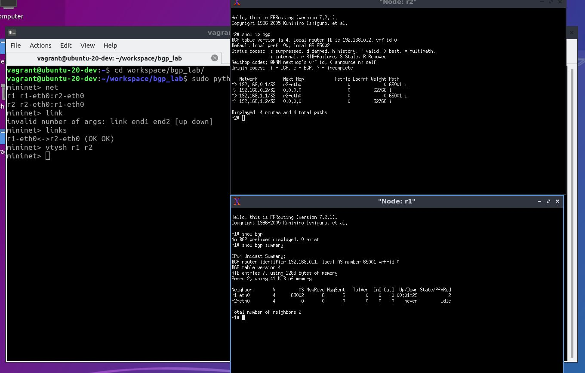

# IP Network Experiments (ipnet)

`ipnet` is mininet extentions for learning OSPF, BGP, SRv6 and more.

## install
1. install mininet
2. install FRRouting
3. install ipnet following command
```commandline
git clone https://github.com/shu1r0/ipnet_mininet.git
cd ipnet_mininet
sudo pip install -r requirements.txt
sudo pip install .
```

## Example
```python
from mininet.log import setLogLevel
from ipnet import IPNetwork, CLIX

r1_conf = """\
configure terminal
interface lo
  ip address 1.1.1.1/32
interface r1_r2
  ip address 192.168.1.1/24
router ospf
  network 1.1.1.1/32 area 0.0.0.0
  network 192.168.1.0/24 area 0.0.0.0
"""

r2_conf = """\
configure terminal
interface lo
  ip address 2.2.2.2/32
interface r2_r1
  ip address 192.168.1.2/24
router ospf
  network 2.2.2.2/32 area 0.0.0.0
  network 192.168.1.0/24 area 0.0.0.0
"""

def run():
    setLogLevel("info")
    net = IPNetwork()
    r1 = net.addFRR('r1', enable_daemons=["ospfd"])
    r2 = net.addFRR('r2', enable_daemons=["ospfd"])
    net.addLink(r1, r2, intfName1="r1_r2", intfName2="r2_r1")
    net.start()
    r1.vtysh_cmd(r1_conf)
    r2.vtysh_cmd(r2_conf)
    CLIX(net)
    net.stop()
    
if __name__ == "__main__":
    run()
```


## start vtysh

example of `vtysh`

```commandline
mininet> vtysh r1 r2
```




## Test
```bash
sudo python3 -m unittest discover examples
```