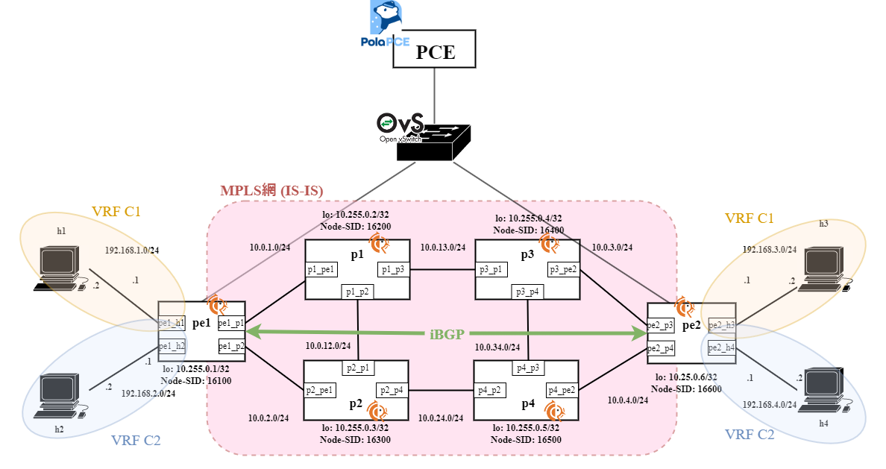

# MPLS Examples

## MPLS Config
```comandline
sudo apt install -y linux-modules-extra-`uname -r`
sudo modprobe mpls-router
sudo modprobe mpls-gso
sudo modprobe mpls-iptunnel
```

## `sr_mpls_vpn_10`


## `sr_mpls_10.py`


## MPLS (SR-MPLS) comand
* `show mpls table`
* `show ip ospf database segment-routing`